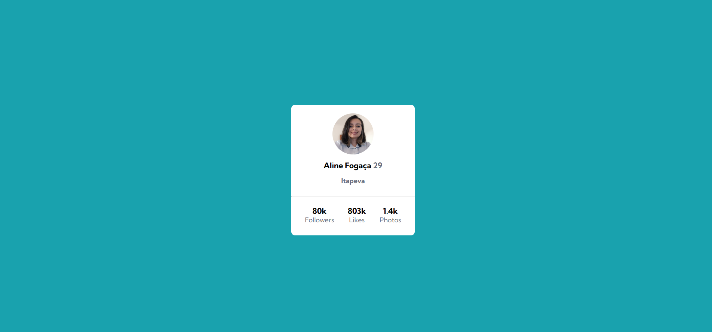
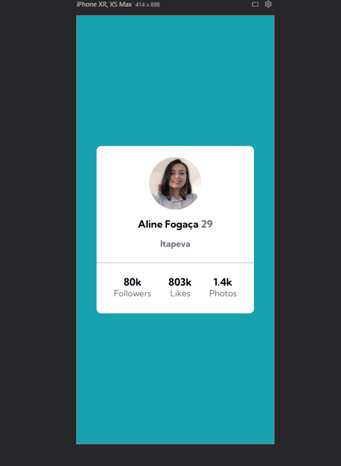

# Desafio Frontend Mentor -Cartão de Perfil

Está é a solução para [ o desafio do componente do cartão de perfil no Frontend Mentor](https://www.frontendmentor.io/challenges/profile-card-component-cfArpWshJ). Os desafios encontrados no Frontend Mentor, o ajudam a melhorar suas habilidades de codificação, construindo projetos realistas.

## Índice

- [Visão Geral](#overview)
  - [O Desafio](#the-challenge)
  - [Screenshot](#screenshot)
  - [Links](#links)
- [Meu processo](#my-process)
  - [Construído com](#built-with)
  - [O que eu aprendi](#what-i-learned)
  - [Desenvolvimento contínuo](#continued-development)
  - [Recursos úteis](#useful-resources)
- [Autor](#author)
- [Agradecimentos](#acknowledgments)


## Visão Geral

### O Desafio

- Construa o projeto para os designs fornecidos.

### Screenshot

Versão desktop:



Versão Mobile:




### Links

- Site Frontend Mentor URL: [Site Frontend Mentor](https://www.frontendmentor.io/challenges/profile-card-component-cfArpWshJ)

## Meu processo

### Construído com:

- HTML5  
- CSS 
- Flexbox


### Oque aprendi

A estrutura hierarquica do elemento <div>, onde se encontra a <div> pai e filhos.
Todos os elementos dentro de uma tag div são considerados filhos, inclusive outras div's, paragráfos<p>, imagens, etc.
A separação do bloco por div's no HTML ajuda na organização e estilização da página, aplicando o flexbox no CSS.

Identificação no código da ordem da div de pai e filhos:

```html
<div class="card">
            <div class="profile-informations">
                
                <h3 class="nome">Aline Fogaça <span class="idade">29</span></h3>
                <p class="cidade">Itapeva</p>
            </div>
  </div>
```
Na estilização com css, segue a regra de pai para filho 
```css
.card .profile-informations img {}
```


### Desenvolvimento Contínuo 

Através do desafio, foi feita alteração na imagem e no nome do cartão de perfil, criando assim, o meu próprio cartão.
Este projeto é a inicialização de aprendizado do HTML e CSS, onde viso aperfeiçoar e refinar o código, e o momento correto para aplicar as div's.
Podendo também aplicar um fundo interativo no cartão de perfil.


### Recursos Úteis

- [Devemdobro](https://devemdobro.com/) - Atráves do curso DevQuest, estou aprendendo do zero sobre programação. 
- [Frontend Mentor](https://www.frontendmentor.com) - Nesta página podemos encontrar vários desafios, para aprimorar os conhecimentos.

## Autor

- GitHub - [LineFog](https://github.com/LineFog)
- Frontend Mentor - [@linefog](https://www.frontendmentor.io/profile/LineFog)


## Agradecimentos
Desafio aplicado no curso DevQuest da plataforma DevemDobro agradecendo pela didática das aulas aplicadas pelos professores Ricardo e Roberto.
Através da aula de reforço de CSS, pude compreender melhor a aplicação correta das div's e a utilização do flexbox.

